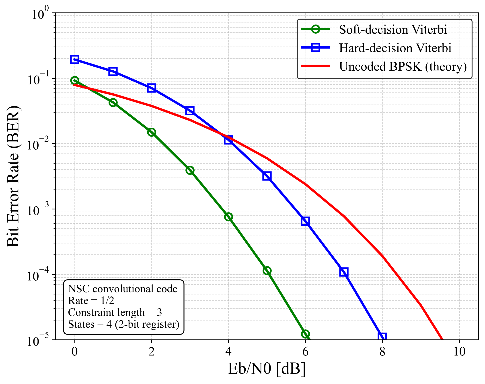

# fec-nsc-codec


A clean and modular C implementation of
**Non-Systematic Convolutional (NSC) Codes** with both
**soft-decision (LLR) and hard-decision Viterbi decoding**.

Includes a branchless trellis-driven encoder/decoder and
a complete **AWGN BER simulation framework**.

---

## 📘 Overview

This repository provides a standalone, research-friendly implementation of a
**rate-1/2 non-systematic convolutional code (NSC)** with:

- 2-bit shift register → **4-state trellis**
- **Constraint length = 3**
- Non-systematic output (two parity bits)
- Branchless table-based encoder
- Soft-decision / Hard-decision Viterbi decoder
- AWGN BER simulation under BPSK

Designed for:

- Wireless communications (4G/5G/6G physical layer)
- FPGA/DSP/embedded platforms
- FEC algorithm education
- Research experiments and performance benchmarking

---

## 📁 Project Structure

```
fec-nsc-codec
├── src/                 # Encoder/decoder core implementation
├── include/             # Public API headers
├── mains/               # BER simulation (AWGN + BPSK)
├── results/             # Generated BER CSV files
├── images/              # BER plots (from python/)
├── python/              # Plotting scripts
├── .github/workflows/   # GitHub Actions CI (GCC build)
├── Makefile             # Build rules
└── README.md            # This document
```

---

## 📑 Features

### ✔ NSC Convolutional Encoder (Rate 1/2)
- 4-state machine (constraint length = 3)
- Non-systematic output (parity only)
- Branchless trellis lookup:
  - `nsc_output_bits[state][input]`
  - `nsc_next_state[state][input]`
- Forced termination using two tail bits → decoder starts/ends in STATE_A

### ✔ Viterbi Decoder
- **Soft-decision Viterbi**
  - LLR-based branch metric
  - Optimal for AWGN channels
- **Hard-decision Viterbi**
  - Hamming metric (0/1 input)
  - Lower computational cost
- Standard forward recursion + traceback
- Fully compatible with the trellis in `trellis.h`

### ✔ AWGN BER Simulation

```
mains/nsc_ber.c
```

evaluates:

- Soft-decision BER
- Hard-decision BER
- Uncoded BPSK theory

Output:

```
results/nsc_ber_data.csv
```

Plots:

```
python python/plot_nsc_ber.py
```

---

## 🛠 Build Instructions

### Requirements
- GCC or Clang
- `make`
- Linux / macOS / WSL / MinGW

### Build

```sh
make
```

Generated binary:

```
nsc_ber     # BER simulation program
```

Clean:

```sh
make clean
```

---

## 🚀 Usage Example

Run BER simulation:

```sh
./nsc_ber
```

Output CSV:

```
results/nsc_ber_data.csv
```

Plot BER/BLER:

```sh
python python/plot_nsc_ber.py
```

---

## 📉 BER Performance

Example BER curve for rate-1/2 NSC
(4-state Viterbi, AWGN, BPSK):



---

## 📂 Source Code Structure

### src/
| File | Description |
|------|-------------|
| `nsc_encoder.c` | Rate-1/2 NSC encoder (branchless) |
| `nsc_decoder.c` | Soft & hard Viterbi decoder |
| `trellis.c` | Trellis tables (output + next state) |

### include/
| File | Description |
|------|-------------|
| `nsc_encoder.h` | Encoder API |
| `nsc_decoder.h` | Decoder API |
| `trellis.h` | Trellis definitions |

### mains/
| File | Description |
|------|-------------|
| `nsc_ber.c` | AWGN BER simulation |

### python/
| File | Description |
|------|-------------|
| `plot_nsc_ber.py` | BER plotting script |

---

## 🔒 Confidentiality Notice

All source code in this repository was developed independently,
based only on public standards and academic knowledge.
No confidential or proprietary information from any company, internship,
or NDA-protected environment is used.

---

## 📜 License

This project is licensed under the **MIT License**.
Free to use for research, education, and commercial applications.

---

## 🤝 Contributing

Pull requests are welcome.
For significant changes, please open an issue first.

---

## ⭐ Acknowledgements

Developed as part of research on
**Forward Error Correction (FEC)** and **physical-layer communications**.

If you find this repository useful, please consider giving it a ⭐！
