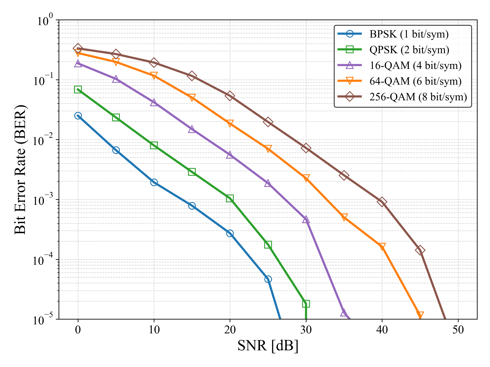

# 📡 **mimo-ofdm-channel-simulator**


A clean and modular C implementation of
**MIMO-OFDM downlink channel simulation**, including:

- 3GPP **TDL-A/B/C** fading models
- UE-speed-dependent **Jakes Doppler**
- OFDM modulation (IFFT/FFT + CP)
- Multi-QAM (BPSK/QPSK/16QAM/64QAM/256QAM)
- **ZF / MMSE MIMO equalization**
- BER evaluation for **1×1 ～ 2×2 MIMO**

Designed for **5G/6G physical-layer research**, algorithm benchmarking, and education.

---

## 📘 Overview

This repository provides a self-contained simulator for a
**3GPP-style downlink MIMO-OFDM PHY**, implementing:

- 1×1, 2×1, 1×2, 2×2 MIMO spatial multiplexing
- Frequency-selective **TDL-A/B/C channels**
- Time-varying fading using **Jakes-like Doppler**
- Linear MIMO equalizers (**ZF / MMSE**)
- Gray-mapped multi-QAM
- Full BER pipeline
  *(bit generation → OFDM → channel → equalizer → demod → BER)*

Suitable for:

- Wireless communications research
- Evaluation of MIMO algorithms
- Fading channel modeling
- Lightweight PHY simulation without MATLAB or heavy frameworks

---

## 📁 Project Structure

```
mimo-ofdm-channel-simulator
├── src/                 # OFDM, TDL channel, MIMO equalizer, modulator
├── include/             # Public headers
├── mains/               # Main BER simulation (MIMO)
├── results/             # BER CSV files
├── images/              # Plots generated by python scripts
├── python/              # Plotting scripts
├── Makefile             # Build rules
└── README.md            # Documentation
```

---

## 📑 Features

### ✔ OFDM Processing
- Nfft = 256 (easily configurable)
- CP insertion / removal
- FFT / IFFT wrappers
- Compatible with 30 kHz NR-like numerology

### ✔ 3GPP TDL Fading Channel
- Profiles: **TDL-A / TDL-B / TDL-C**
- Rayleigh fading per tap
- Jakes-like Doppler time evolution
- Adjustable RMS delay spread
- Independent channels for each MIMO link

### ✔ Multi-QAM Modem
- BPSK / QPSK / 16QAM / 64QAM / 256QAM
- Gray mapping
- Es = 1 normalization

### ✔ MIMO Equalizers
- **ZF**
- **MMSE**
- Supports 1×1, 2×1, 1×2, 2×2
- Per-subcarrier equalization using frequency-domain H[k]

### ✔ Perfect CSI
Frequency-domain channel **H[k]** is computed directly from TDL taps
(ideal CSI for algorithm evaluation).

### ✔ BER Simulation

Main simulation program:

```
mains/mimo_ofdm_ber.c
```

Generates BER CSV:

```
results/mimo_ofdm_ber_data.csv
```

Plotting:

```
python python/plot_mimo_ofdm_ber.py
```

---

## 🛠 Build Instructions

### Requirements
- GCC / Clang
- make
- Linux / macOS / WSL / MinGW
- Python3 + matplotlib (optional for plotting)

### Build

```sh
make
```

Binary:

```
bin/mimo_ofdm_ber
```

Run:

```sh
make run
```

Clean:

```sh
make clean
```

---

## 🚀 Usage Example

Run full BER simulation:

```sh
./bin/mimo_ofdm_ber
```

Output CSV:

```
results/mimo_ofdm_ber_data.csv
```

Plot BER curves:

```sh
python python/plot_mimo_ofdm_ber.py
```

---

## 📉 BER Performance Example



---

## 📂 Source Code Structure

### src/
| File | Description |
|------|-------------|
| `ofdm.c` | OFDM modulation/demodulation |
| `modulator.c` | QAM mapping/demapping |
| `channel_tdl.c` | 3GPP TDL fading + Jakes Doppler |
| `mimo.c` | Matrix ops + ZF/MMSE equalization |

### include/
| File | Description |
|------|-------------|
| `ofdm.h` | OFDM API |
| `modulator.h` | QAM modem API |
| `channel_tdl.h` | TDL fading model |
| `mimo.h` | MIMO equalizer/matrix utilities |

### mains/
| File | Description |
|------|-------------|
| `mimo_ofdm_ber.c` | Main BER simulation program |

---

## 🔒 Confidentiality Notice

All source code in this repository was developed independently
using only **public 3GPP specifications** and academic knowledge.
No proprietary or confidential information is used.

---

## 📜 License

Released under the **MIT License**.
Free for research, education, and commercial use.

---

## 🤝 Contributing

Pull requests and feature suggestions are welcome.
For large changes, please open an issue first.

---

## ⭐ Acknowledgements

Developed as part of research on
**MIMO-OFDM, fading channels, and physical-layer signal processing**.

If you find this project useful, please consider giving it a ⭐！

